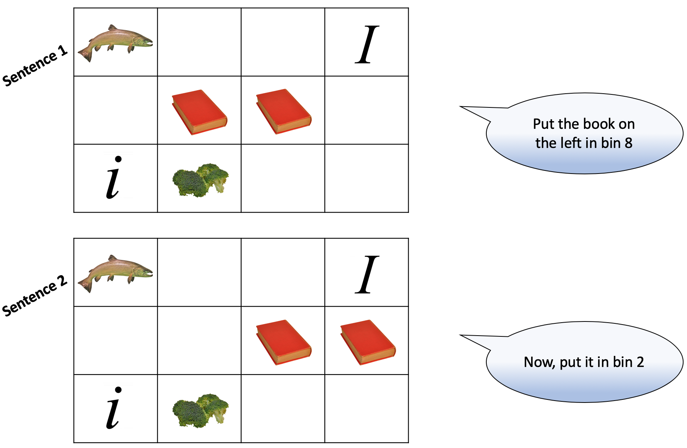

# Experiment Proposal

## Description

Pronoun resolution is a process that we employ in discourse in order to optimize communication. When we encounter a pronoun, we "resolve" it by linking it to the appropriate noun/concept within the discourse model. However, we don't know exactly how this resolution process works. There are two contrasting traditions that attempt to explain the process: in the memory-motivated tradition, pronouns reactivate information from long-term memory about form and meaning in order to link a pronoun to the correct antecedent (i.e., the noun/concept the pronoun refers to), whereas in the linguistic tradition, a more computational-like process is used, operating solely on syntactical information where a grammatical pronoun is logically linked to its grammatical noun complement. The purpose of my experiment is to find out which of the two traditions underlines the pronoun resolution process in instances where the pronoun-antecedent link is ambiguous.

This experiment will examine how native English-speaking adult subjects (_n_ = 40) resolve ambiguous pronouns, particularly when items of interest undergo property changes in a visual transformation exercise. The experiment is a 2x2 design yielding four conditions. There are 20 target trials and 42 filler trials. Each trial presents a novel 3(_l_)x4(_w_) grid, and its squares are consecutively numbered from 1-12. Six items reside within each critical trial grid - two items comprise the target pair (such as two identical books); two items comprise an irrelevant pair of items (such as a lowercase _i_ and uppercase _i_); and two items are unrelated single items (such as a fish and some broccoli). The subject is positioned to look at the grids on a wide-screen computer monitor. In a given trial, the subject will hear two pre-recorded instructional sentences spoken by a native English speaker. Each sentence instructs the subject to perform an action on one of the items within the grid using a computer mouse. The subject's gaze is measured from sentence audio onset to action performance in both trial sentences using eye-tracking techniques.

In a critical trial, the first pre-recorded sentence instructs the subject to move one member of the target pair to another square along the same row. Here, the item is referred to by its location relative to the other pair member (e.g., _“Move the book on the **[left/right]** to bin 1”_). Once the subject completes the first action, they hear the second sentence. This sentence instructs them to move one member of the target pair - either the item from the previous sentence or the unmentioned item of the pair - to another area of the grid. The second sentence varies by condition. In two of the four conditions, the target item is referred to by a disambiguating noun phrase (e.g., _“Now, move **[the same/the other]** book to bin 4”_). In the remaining two conditions, the target item is referred to by the indexical pronoun 'it' (_"Now, move it..."_). The indexical pronoun is either disambiguating based on the transformation in the first sentence (e.g., the 'book on the left' was moved to a left-hand square, thus retaining its identity as 'the book on the left'), or becomes ambiguous based on the first transformation (e.g., 'the book on the left' was moved into a square to the right of the other book and becomes 'the book on the right'). The ambiguous pronoun condition is of particular interest as the target item's identity changes within a trial, and information about where subjects look upon hearing the sentence is hypothesized to shed some light on the memory vs. linguistic traditions of pronoun resolution.

#### Here's a snapshot of a condition 4 (ambiguous) trial, separated by sentence 1 and sentence 2:



## Pseudocode

### 1. Experiment Overview


```python
# Experiment contains 62 trials

# 20 critical trials, 42 filler trials

CriticalTrials = trial[0:19]   # trials 1-20
FillerTrials = trial[20:61]    # trials 21-62

# ignore range exclusivity; just showing that there are 62 trials and which trials
# are criticals/fillers.
experiment = trial[0:61]  
```

##### 1.1 | Factors, Conditions, Blocks, and Lists

```python

# Preliminary info
    
# Specify item referred to in first sentence (S1)

S1item = one member of pair

# Specify item referred to in second sentence (S2)

SameReferent = same item of pair
NewReferent = other item of pair


# Factors

# Specify referring phrase type used in S2
#   note: NP stands for 'noun phrase'
#   note: this isn't the condition-specific language; that comes later in this script

NP = ["Now, move the [same/other] [item] to bin b."]
pronoun = ["Now, move it to bin b."]

# Conditions

# Characterizing conditions by factors using [S2 referent item.S2 referring phrase type] syntax

cond1 = SameReferent.NP
cond2 = SameReferent.pronoun
cond3 = NewReferent.NP
cond4 = NewReferent.pronoun


# Blocks

# Four blocks of critical trials × 5 trials each
#   note: range exclusivity begins here

block1 = trial[0:5]
block2 = trial[5:10]
block3 = trial[10:15]
block4 = trial[15:20]

# Setting up list arrays

list_a = ([block1:cond1], [block2:cond2, block3:cond3, block4:cond4])
list_b = ([block1:cond2, block2:cond3, block3:cond4, block4:cond1])
list_c = ([block1:cond3, block2:cond4, block3:cond1, block4:cond2])
list_d = ([block1:cond4, block2:cond1, block3:cond2, block4:cond3])

# Randomize trials within blocks

within blocks:
        randomize trials
    (such that, for example, shuffle(block1:condition1) for participant x yields
    block1 array [4,2,0,1,3])
     
# Shuffling through lists a-d by participant

for participants in experiment:
        shuffle between list[a, b, c, d]
    (such that participant 1 = list[0], participant 2 = list[1], etc.)
```

##### 1.2 | Grid Layout

```python

# Each grid has 12 squares in a 4 (length) × 3 (height) arrangement.

# Each square will be numbered from 1-12 from left-right, top-bottom.
        
# Each grid layout will be pre-loaded with items that are movable.


# Read in the images

# for trial 1:

grid1 = "~/experiment/visual/grid1.png"   # (whatever the proper extension for an interactive file is)

#   and so on for all 62 trials.
 
# load the grid in at the beginning of each trial

for trial in trial[:62]:
    at onset of each trial:
        load grid[]
```

### 2. Critical Trials Setup

#### 2.1 | Language

```python
#   note: assume that each sentence is being re-assigned with more trial-specific info 
#   in each step here

# Specify language for S1

S1 = "Move the x on the [0] to bin a."

# Choose left/right for trial:

if [0] is True:
    replace with "left"
else:
    replace with "right"
for trial[::2]:
    [0] = True
for trial [1::2]:
    [0] = False
    
# so, for example, for S1 in trials 1 and 2, using syntax [trial[].S1]:

print(trial[0].S1)
output: "Move the x on the left to bin a."

print(trial[1].S1)
output: "Move the x on the right to bin a."
    

# Specify language for S2 by condition

S2cond1 = "Now, move the same x to bin b."
S2cond3 = "Now, move the other x to bin b."
S2condPro = "Now, move it to bin []."   # same S2 sentence for conditions 2 and 4

# build out list of critical trial target pairs and corresponding strings for syntax:

pair0 = "book"
pair1 = "plant"
    # (and so forth until 'pair19')

# Adding trial-specific pairs into language
# Have pair correspond with trial number
# Syntax for discussing language corresponding to a trial in condition x: trial[].condlanguage

# For condition 1:

for x in trial[].S2cond1: 
    for trial[:20]:
        assign S2cond1 language to each trial
    then:
        replace 'x' with 'pair0' (for trial 1), 'pair1' (for trial 2), etc. corresponding
        to each trial

for 'pair[]' in trial[:20].S2cond1:
    replace 'pair[]' with corresponding string

# so, for example:
    
print(trial[0].S2cond1)
output: "Now, move the same book to bin b."


# And the same for condition 3:

for x in trial[].S2cond3: 
    for trial[20]:
        assign S2cond3 language to each trial
    then:
        replace 'x' with 'pair0' (for trial 1), 'pair1' (for trial 2), etc. corresponding
        to each trial

for 'pair[]' in trial[:20].S2cond3:
    replace 'pair[]' with corresponding string

# so, for example, you would get something like this:
    
print(trial[1].S2cond3)
output: "Now, move the other plant to bin b."

# note: I repeat a few lines here later in the script in a single loop 
# for clarity to concatenate an enture S2 sentence. I'm leaving it here
# because it's helpful for me to remember exactly how I did it step-by-step!
```

#### 2.2 | Bin Numbers for S1

```python
# This one is tricky because I haven't finalized my trial schema.
# I will have a specific schema for every sentence in every trial of every condition.

# For the sake of simplicity, I will do essentially the same thing that I did in
# the language step above and assign bin numbers by trial.
#   (note: 'a' corresponds to S1, 'b' corresponds to S2 in all critical + filler trials)

# An important note about the pronoun conditions is that there will be two layouts:
# One version will be specific to condition 2, in which the item transformation in S1
# must remain on the same side of the other member of the pair.
# One version will be specific to condition 4, in which the item tranformation in S1
# must move the item to the other side of the other member of the pair.


# I'm starting with pronoun conditions (2 and 4) because they're more complicated.

# First, build out list of critical trial bin numbers in S1 specific to condition 2:

a0c2 = "5"
a1c2 = "11"
#    and so forth (until a19c2)


# Condition 2

# Replace a with condition 2-specific bin number using the following syntax: trial.S1condition
    
for a in trial[].S1condPro: 
    for trial[:20]:
        if cond2:
            replace 'a' with 'a0c2' (for trial 1), 'a1c2' (for trial 2), etc. corresponding
            to each trial

for a[]c2 in trial[:20].S1cond2:
    Replace 'a[]c2' with corresponding string

# For example:
    
print(trial[0].S1cond2)
output: "Move the book on the left to bin 5."

print(trial[1].S1cond2)
output: "Move the plant on the right to bin 11."


# Condition 4

# list of bin numbers - condition 4

a0c4 = "12"
a1c4 = "9"

for a in trial[].S1condPro: 
    for trial[:20]:
        if cond4:
            replace 'a' with 'a0c4' (for trial 1), 'a1c4' (for trial 2), etc. corresponding
            to each trial

for a[]c4 in trial[:20].S1cond2:
    Replace 'a[]c4' with corresponding string


# Now, for the noun phrase conditions...

# Condition 1

# list of bin numbers - condition 1

a0c1 = "2"
a1c1 = "6"

for a in trial[].S1cond1: 
    for trial[:20]:
            replace 'a' with 'a0c1' (for trial 1), 'a1c1' (for trial 2), etc. corresponding
            to each trial

for a[]c1 in trial[:20].S1cond1:
    replace 'a[]c1' with corresponding string


# Condition 3

# list of bin numbers - condition 3

a0c3 = "1"
a1c3 = "7"

for a in trial[].S1cond3: 
    for trial[:20]:
        replace 'a' with 'a0c3' (for trial 1), 'a1c3' (for trial 2), etc. corresponding
        to each trial

for a[]c3 in trial[:20].S1cond1:
    replace 'a[]c3' with corresponding string
```

#### 2.3 | Bin Numbers for S2

```python
# list of bin numbers per condition:

# condition 1

b0c1 = "4"
b1c1 = "1"

# condition 2

b0c2 = "10"
b1c2 = "3"

# condition 3

b0c3 = "5"
b1c3 = "2"

# condition 4

b0c4 = "11"
b1c4 = "6"


# Piece it all together for S2
#   note: this is where the repetition of the pair loops is

# Condition 1

for x in trial[].S2cond1:
    for trial[:20]:
        in S2cond1:
            replace x with 'pair0' (for trial 1), 'pair1' (for trial 2), etc. corresponding
            to each trial
        then:
            replace b with 'b0c1' (for trial 1), 'b1c1' (for trial 2), etc. corresponding
            to each trial
        then:
            for 'pair[]' in trial[:20].S2cond1:
                replace 'pair[]' with corresponding string
        then:
            for 'b[]c1' in trial[:20].S2cond1:
                replace 'b[]c1' with corresponding string
   
# For example: 
                
print(trial[0].S2cond1)
output: "Now, move the same book to bin 4."

print(trial[1].S2cond1)
output: "Now, move the same plant to bin 1."


# Condition 2

for x in trial[].S2cond2:
    for trial[:20]:
        in S2cond2:
            replace x with 'pair0' (for trial 1), 'pair1' (for trial 2), etc. corresponding
            to each trial
        then:
            replace b with 'b0c2' (for trial 1), 'b1c2' (for trial 2), etc. corresponding
            to each trial
        then:
            for 'pair[]' in trial[:20].S2cond2:
                replace 'pair[]' with corresponding string
        then:
            for 'b[]c2' in trial[:20].S2cond2:
                replace 'b[]c2' with corresponding string
        
# Condition 3

for x in trial[].S2cond3:
    for trial[:20]:
        in S2cond3:
            replace x with 'pair0' (for trial 1), 'pair1' (for trial 2), etc. corresponding
            to each trial
        then:
            replace b with 'b0c3' (for trial 1), 'b1c3' (for trial 2), etc. corresponding
            to each trial
        then:
            for 'pair[]' in trial[:20].S2cond3:
                replace 'pair[]' with corresponding string
        then:
            for 'b[]c3' in trial[:20].S2cond3:
                replace 'b[]c3' with corresponding string

# Condition 4

for x in trial[].S2cond4:
    for trial[:20]:
        in S2cond4:
            replace x with 'pair0' (for trial 1), 'pair1' (for trial 2), etc. corresponding
            to each trial
        then:
            replace b with 'b0c4' (for trial 1), 'b1c4' (for trial 2), etc. corresponding
            to each trial
        then:
            for 'pair[]' in trial[:20].S2cond4:
                replace 'pair[]' with corresponding string
        then:
            for 'b[]c4' in trial[:20].S2cond4:
                replace 'b[]c4' with corresponding string
```

#### 2.4 | Putting them all together

```python
# Concatenating language together for each condition for clarity

# Condition 1
                
S1trial1cond1 = trial[0].S1cond1

S2trial1cond1 = trial[0].S2cond1

trial1cond1 = S1trial1cond1 + S2trial1cond1

print(trial1cond1)
output: "Move the book on the left to bin 2."
        "Now, move the same book to bin 4."

.
.
.
# ...And so forth for all conditions and trials.

# Realistically, the program will run the pre-recorded audio that won't require
# these functions, but helpful to have just in case.

# At a list level, each member of a block will have a corresponding output of
# the 'trial[]cond[]' syntax. So for example, in the 'block1:cond1' list,
# the members of that list (before randomization) will be as follows:

print(block1:cond1)
output: cond1.trial[1, 2, 3, 4, 5]


for x in cond1.trial:
    for trial[:5]:
        in 'trial[]cond1':
            replace [] with x

# And this will loop through the list to yield the condition-specific sentences.
```

### 3. Filler Trial Setup


```python
# Three filler types
    # A - 2+ same-category items present, but never referred to
    # B - pairs start in different rows (in trials, they must start in same row)
    # C - all items in grid are fully distinct

# No need to break down sentences in code by filler type as sentences will have items
# individually assigned to them, meaning the typing will be taken care of in the
# array preparation prior to programming.
        
# Intersperse critical trials and filler trials randomly while still following
# list succession per participant
            
for participant in experiment:
    within participant-specified list:
        randomize(trials within blocks)
    randomize filler trials throughout experiment
```

#### 3.1 | Language


```python
# All fillers refer to a different item in each sentence. They aren't referred 
# to by their locative property relative to other items, but rather by their
# essential descriptions (e.g., 'paper airplane' vs. 'Boeing 747'.)
    
# Some fillers refer to items that are NOT in a pair (C), but this distinction
# doesn't matter for this pseudocode.
    
# S1 and S2 language
    
S1filler = "Move the x to bin a."

S2filler = "Now, move the y to bin b."


# create a list of items for 84 (42 trials × 2 sentences per trial) filler items; 
# organize by trial[].S1item/S2item. For first two filler trials:

filler20_S1item = "paper airplane"
filler20_S2item = "Boeing 747"

filler21_S1item = "lowercase i"
filler21_S2item = "uppercase i"

# Assigning item strings - S1

for x in trial[].S1filler:
    for trial[20:62]:
        assign S1filler language to each trial
    then:
        replace 'x' with 'filler20_S1item' (for trial 21), 'filler21_S1item'
        (for trial 22), etc. corresponding to each trial

for 'filler[]_S1item' in trial[20:62]:
    replace 'filler[]_S1item' with corresponding string
    
# Mapping items - S2

for x in trial[].S2filler:
    for trial[20:62]:
        assign S2filler language to each trial
    then:
        replace 'x' with 'filler20_S2item' (for trial 21), 'filler21_S2item'
        (for trial 22), etc. corresponding to each trial

for 'filler[]_S2item' in trial[20:62]:
    replace 'filler[].S2item' with corresponding string

# for example:

print(trial[20].S1filler)
output: "Move the paper airplane to bin a."
print(trial[20].S2filler)
output: "Now, move the Boeing 747 to bin b."
```

#### 3.2 | Bin numbers for S1


```python
# First, build out list of critical trial bin numbers in S1 specific to condition 2:
# (note: a corresponds to S1, b corresponds to S2)

a20 = "4"
a21 = "9"
# and so forth (until a61)

# Now, replace a with trial-specific bin number using the following syntax: trial.S1filler
    
for a in trial[].S1filler: 
    for trial[20:62]:
        replace 'a' with 'a20' (for trial 21), 'a21' (for trial 22), etc. 
        corresponding to each trial

for a[] in trial[20:62].S1filler:
    replace 'a[]' with corresponding string

# for example:

print(trial[20].S1filler)
output: "Move the paper airplane to bin 4."
```

#### 3.3 | Bin numbers for S2


```python
# First, build out list of critical trial bin numbers in S1 specific to condition 2:
# (note: a corresponds to S1, b corresponds to S2)

b20 = "12"
b21 = "1"
# and so forth (until a61)

# Now, replace a with trial-specific bin number using the following syntax: trial.S2filler
    
for b in trial[].S2filler: 
    for trial[20:62]:
        replace 'b' with 'b20' (for trial 21), 'b21' (for trial 22), etc. 
        corresponding to each trial

for a[] in trial[20:62].S2filler:
    replace 'b[]' with corresponding string

# for example:

print(trial[20].S2filler)
output: "Now, move the Boeing 747 to bin 12."
```

#### 3.4 | Putting them all together


```python
# Putting Them All Together - Filler Trials

# Concatenating language for each filler trial for clarity.
# Assume for simplicity that the 'trial[].[S1/S2]filler' sentences are now populated.

# Trial 22 (second filler trial - just for a new example)
                
S1trial22 = trial[21].S1filler

S2trial22 = trial[21].S2filler

trial22 = S1trial22 
        + S2trial22

print(trial22)
output: "Move the lowercase i to bin 9."
        "Now, move the uppercase i to bin 1."
.
.
.
# ...and so forth for remaining filler trials, if we want to concatenate them for clarity.
```

### 4. Pre-Recorded Audio

#### 4.1 | For critical trials


```python
# Assign an audio file to each sentence using condition 1, trial 1, sentence 1 as example:

S1trial1cond1audio = "~/experiment/criticalaudio/condition1/trial1.mp4"

# Syntax for audio files: 

[S1/S2]trial[]cond[]audio


# Trigger audio for each critical sentence

for S1 in trial[:20]:
    when grid appears at start of each trial:
        wait 1 second
    then 
        trigger S1trial[]cond[]audio 

for S2 in trial[:20]:
    when transformation is completed:
        wait 1 second
    then 
        trigger S2trial[]cond[]audio 
```

#### 4.2 | For filler trials


```python
# Assign an audio file to each sentence using trial 21, sentence 1 as example:

S1trial22audio = "~/experiment/filleraudio/trial22.mp4"

# Syntax for audio files:

[S1/S2]trial[]audio


# Trigger audio for each critical sentence

for S1 in trial[20:62]:
    when grid appears at start of each trial:
        wait 1 second
    then 
        trigger S1trial[]audio 

for S2 in trial[20:62]:
    when transformation is completed:
        wait 1 second
    then 
        trigger S2trial[]audio 
        
# note: I've split critical and filler up for the sake of simpler naming conventions
# of the audio files.
```

### 5. Measurement


```python
# The experiment will track eye gaze from sentence onset to transformation completion.
            
for each sentence:
    at audio onset:
        begin eye tracking
    at transformation completion:
        cease session
```

### 6. For Further Development

Further code development needed for:

* allowing subject to pick up and drag items
* recognizing the onset of trial 1, as all other trials are triggered by successful completion of the previous trial
* identifying a successful trial completion
* creating instructions at the beginning of the experiment (don't have these yet)
* briefly flashing translucent bin numbers in a sample grid before trials to show how bins are numbered
